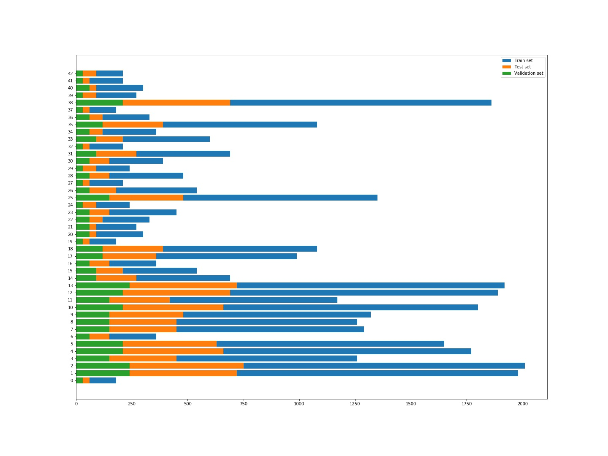
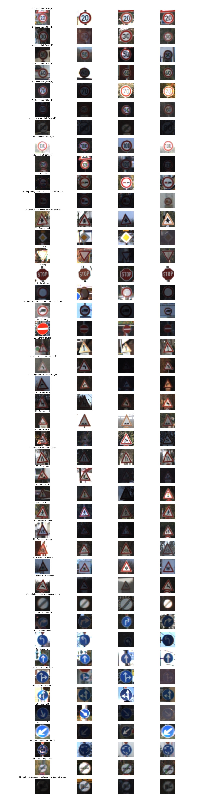
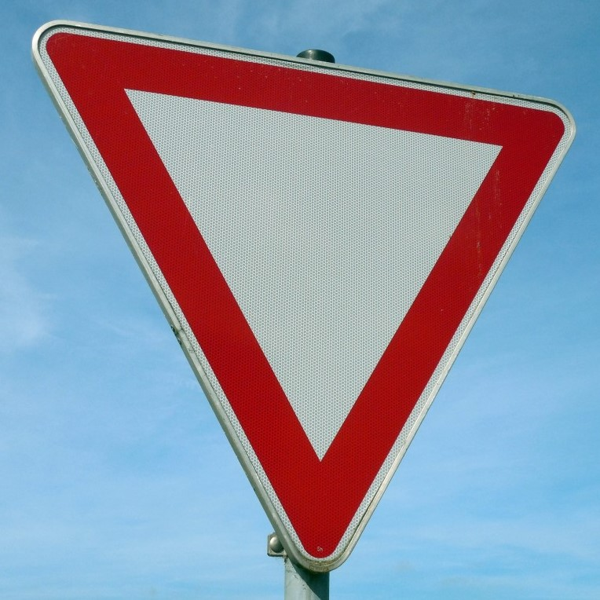
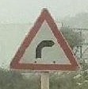
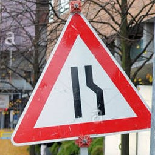

# Traffic Sign Classifier Project

The goal of the project is to apply deep neural networks and convolutional neural networks to classify traffic signs.

The steps of this project are the following:
*	Load the data set (see below for links to the project data set)
*	Explore, summarize and visualize the data set
*	Design, train and test a model architecture
*	Use the model to make predictions on new images
*	Analyze the softmax probabilities of the new images
*	Summarize the results with a written report

## Dependencies

The project environment can be created with [CarND Term1 Starter Kit](https://github.com/udacity/CarND-Term1-Starter-Kit).

The used dataset can be downloaded [here](https://s3-us-west-1.amazonaws.com/udacity-selfdrivingcar/traffic-signs-data.zip).

## Data Set Summary & Exploration
### 1. Basic summary of the data set. 
Once the data sets are imported, I used the numpy library to calculate summary statistics of the traffic signs data set:
*	The size of training set is 3799
*	The size of the validation set is 4410
*	The size of test set is 12630
*	The shape of a traffic sign image is (32, 32, 3)
*	The number of unique classes/labels in the data set is 43

### 2. Exploratory visualization of the dataset.
Here is a horizontal histogram chart showing how the three data sets are distributed along the different labels.
 
 
 
In order to have a better idea of the training set, for each label, I printed out 4 random images. The output is visible in the image below.
 
 
 
## Design and Test a Model Architecture

### 1. Image data preprocess 

As a first step, I converted the image to grayscale. I decided to grayscale them by simply averaging the Red Green and Blue values of the original image.

After, I normalized the images in order to have the grayscale values inside the range [-1, 1].

Keeping the gray values inside this range instead of [0, 255] is fundamental for the training operation in order to get good performances of the model.

Then I shuffled the data using the specific function.

Note: in the first project submission, I decided to omit the grayscaling process since in terms of accuracy it does not give us better result.

Thanks to the reviewer I realized that this method helps to drastically reduce the image dimension and the computational load. In fact, keeping approximately the same accuracy, the images to be processed have 1/3 of the original RGB image dimension. 

### 2. Model architecture
My final model consisted of a standard LeNet architecture and, in particular, is made of the following layers:

| Layer             | Description                                 |
| :-:	              | :-:	                                        |
| Input  	          | 32x32x3 RGB image 	                        |
| Convolution 1 	  | 1x1 stride, VALID padding, output: 28x28x6	|
| RELU 	            |  	                                          |
| Max pooling 1	    | 2x2 stride, VALID padding, output: 14x14x6	|
| Convolution 2  	  | 1x1 stride, VALID padding, output: 10x10x16 |
| RELU	 	          |   	                                        |
| Max pooling 2	    | 2x2 stride, VALID padding, output: 5x5x16  	|
| Flatten	 	        | Output: 400 	                              |
| Fully connected  	| Input: 400, output: 120	                    |
| RELU	            |  	                                          |
| Fully connected 	| Input: 120, output: 84 	                    |
| RELU	            |   	                                        |
| Fully connected 	| Input: 84, output: 43  	                    |	

### 3. Model training
To train the model, after some tuning, I decided to use the following hyperparameters:
*	Epochs = 20
*	Batch size = 128
*	Learning rate = 0.001
For the training optimization, I used the softmax_cross_entropy_with_logits function which compares the evaluated logits with the one hot end labels.

This gives the cross entropy which is a measure of how different the logits are from the ground truth training labels.
Next, the cross-entropy values are averaged along all the training images.
Then, I minimize the loss function using the AdamOptimizer function which is similar to the stochastic gradient descent method.

### 4. Results
My final model results were:
*	training set accuracy of 0.993
*	validation set accuracy of 0.976 
*	test set accuracy of 0.891
These results satisfy the minimum requests for the project completion.

## Test a Model on New Images
### 1. Chosen images 
Here are five German traffic signs that I found on the web:

  
   
  
  
  

     
In these images, I picked signs that might have some additional difficulty in the prediction.
For example, the third image 'Go straight or left' is taken from a steep angle.
In addition, the fourth image 'Road work' presents sone differences from the one in the dataset. In fact, the background is yellow instead of white.

### 2. Model's predictions on the new traffic signs.
Here are the results of the prediction on the new images:

|	    | Image                         |	Prediction                    |
| :-: | :-:                           | :-:                           |
| 1	  | Yield	                        | Yield                         |
| 2	  | Dangerous curve to the right  |	Dangerous curve to the right  |
| 3	  | Go straight or left	          | Go straight or left           |
| 4	  | Road work                     |	Road work                     |
| 5	  | Road narrows to the right     |	Road narrows to the right     |

The model was able to correctly guess all the 5 traffic signs, which gives an accuracy of 100%. This result is compatible with the one obtained evaluating the accuracy on the given training set.

### 3. Softmax probabilities
Analyzing the top five softmax probabilities for each prediction allows to understand how the model works. For most of the images, the model recognizes with absolute precision the traffic signs.
In the last two images, the correct prediction does not have 100% probability but it is still close to it.

#### Image 1: Yield
| Probability   |	Prediction            |
| :-:           | :-:                   |     
| 100%	        | Yield                 |
| 0%	          | Ahead only            |
| 0%	          | No vehicles           |
| 0%	          | No passing            |
| 0%	          | Speed limit (50km/h)  |

#### Image 2: Dangerous curve to the right
| Probability   |	Prediction                            |
| :-:           | :-:                                   | 
| 99.87%	      | Dangerous curve to the right          |
| 0.10%	        | Slippery road                         |
| 0%            |	Road work                             |
| 0%	          | Right-of-way at the next intersection |
| 0%	          | Children crossing                     |

#### Image 3 : Go straight or left
| Probability   |	Prediction                                    |
| :-:           | :-:                                           | 
| 100%	        | Go straight or left                           |
| 0%	          | Dangerous curve to the left                   |
| 0%	          | Keep left                                     |
| 0%	          | No passing for vehicles over 3.5 metric tons  |
| 0%	          | Traffic signals                               |

#### Image 4: Road work
| Probability   |	Prediction                            |
| :-:           | :-:                                   | 
| 51.42%	      | Road work                             |
| 47.19%	      | Priority road                         |
| 1.39%	        | Right-of-way at the next intersection |
| 0%	          | Speed limit (50km/h)                  |
| 0%	          | Speed limit (80km/h)                  |

#### Image 5: Road narrow to the right
| Probability   |	Prediction                            |
| :-:           | :-:                                   | 
| 93.85%        | Road narrows to the right             |
| 5.81%	        | Bicycles crossing                     |
| 0.23%	        | Speed limit (50km/h)                  |
| 0.07%	        | Children crossing                     |
| 0.03%	        | Road work                             |

## Conclusions
The trained model has a high prediction accuracy and it is also robust since it correctly works with other images taken from internet.
The overall result might be improved by applying some changes:
*	use more sophisticate architectures
*	apply data augmentation (rotation, translation, zoom, flips, and/or color perturbation) in order to have a better view of the signs
*	use more layers on the LeNet architecture

